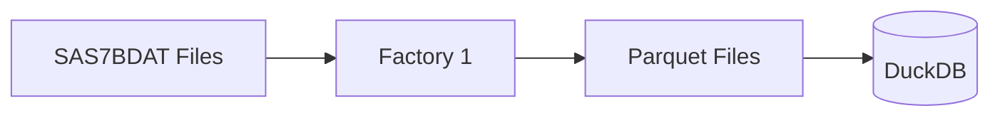

# Data Loading

Load clinical trial data into SAGE using Factory 1.

---

## Overview

Factory 1 transforms SAS7BDAT files into a DuckDB database:



---

## Prerequisites

Before loading data:

1. SAGE services running
2. Access to SAS7BDAT files
3. Administrator permissions

---

## Loading Data

### Step 1: Place Files

Copy SAS7BDAT files to the data directory:

```
data/
└── raw/
    ├── adsl.sas7bdat
    ├── adae.sas7bdat
    ├── adlb.sas7bdat
    └── ...
```

### Step 2: Run Factory 1

```bash
# Load all files
python scripts/factory1_data.py

# Load specific file
python scripts/factory1_data.py --file data/raw/adsl.sas7bdat

# Force reload (overwrite existing)
python scripts/factory1_data.py --force
```

### Step 3: Verify

```bash
# Check loaded tables
python -c "
import duckdb
conn = duckdb.connect('data/database/clinical.duckdb', read_only=True)
print(conn.execute('SHOW TABLES').fetchall())
"
```

---

## Supported Datasets

### SDTM Domains

| Domain | Description |
|--------|-------------|
| DM | Demographics |
| AE | Adverse Events |
| CM | Concomitant Medications |
| LB | Laboratory |
| VS | Vital Signs |
| EX | Exposure |
| MH | Medical History |

### ADaM Datasets

| Dataset | Description |
|---------|-------------|
| ADSL | Subject Level |
| ADAE | Adverse Events Analysis |
| ADLB | Laboratory Analysis |
| ADTTE | Time-to-Event |
| ADEFF | Efficacy |

---

## Configuration

### Environment Variables

```env
# Data paths
RAW_DATA_PATH=/app/data/raw
PROCESSED_DATA_PATH=/app/data/processed
DUCKDB_PATH=/app/data/database/clinical.duckdb

# Processing options
PARQUET_COMPRESSION=snappy
ENABLE_SCHEMA_TRACKING=true
```

---

## Troubleshooting

### File Not Found

```
Error: FileNotFoundError: data/raw/adsl.sas7bdat

Solution: Verify file path and permissions
```

### Encoding Error

```
Error: UnicodeDecodeError

Solution: Specify encoding
python scripts/factory1_data.py --encoding latin1
```

### Schema Mismatch

```
Error: Column 'NEW_COL' not found in existing table

Solution: Use --force to recreate table
python scripts/factory1_data.py --force
```

---

## After Loading Data

1. **Load Metadata**: Run Factory 2 to process specifications
2. **Build Indexes**: Run Factory 3 to create fuzzy matching
3. **Verify**: Test queries in chat interface

---

## Best Practices

1. **Backup First**: Keep original SAS files safe
2. **Version Control**: Track which files were loaded
3. **Validate**: Check row counts match source
4. **Document**: Record loading date and version

---

## Next Steps

- [Metadata Approval](../factories/factory2-metadata/approval-workflow.md)
- [Dictionary Building](../factories/factory3-dictionary/overview.md)
- [User Management](user-management.md)
