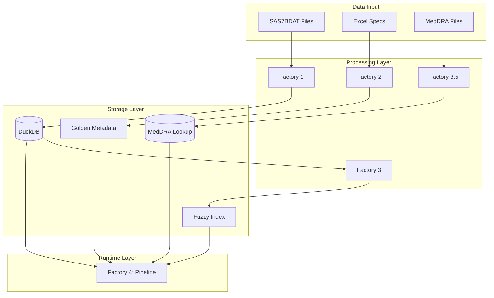
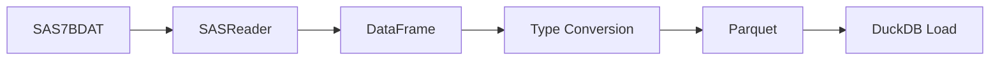
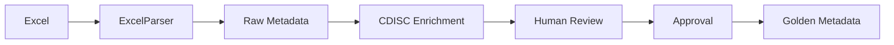
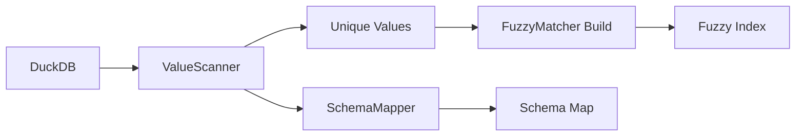
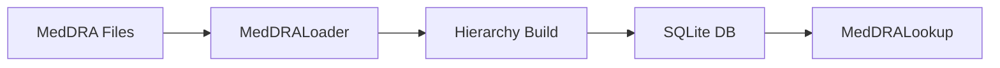
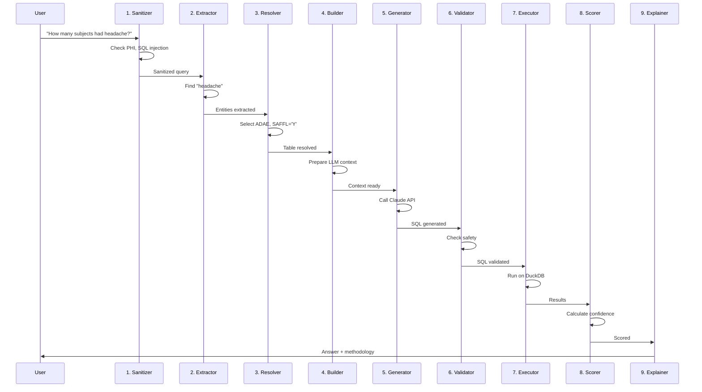
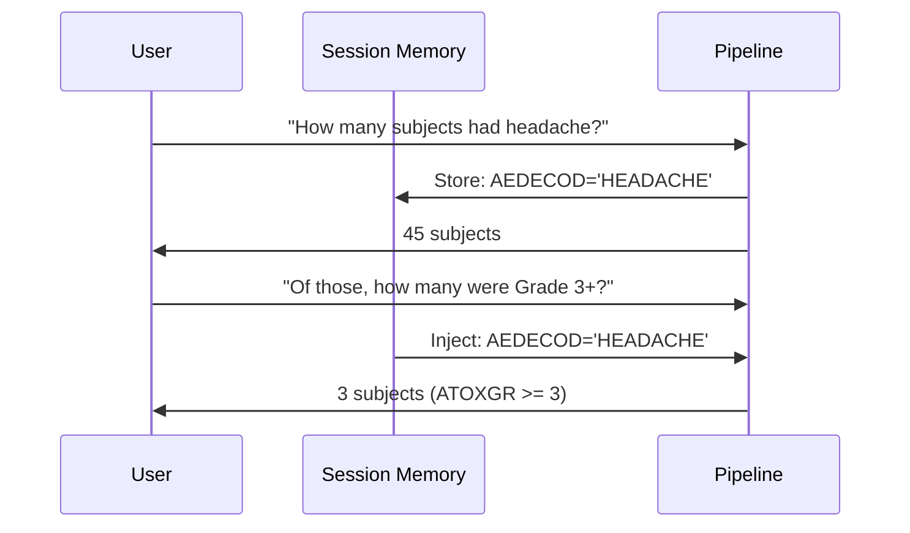
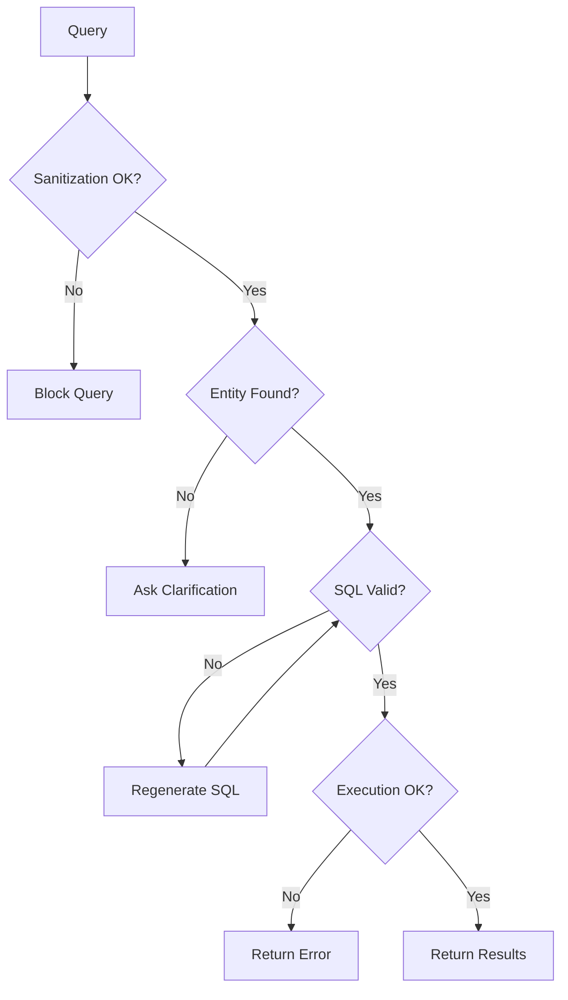

# Data Flow

This document details the complete data flow through SAGE, from raw files to query results.

---

## Overview



---

## Factory 1: Data Ingestion Flow

### Input

- **Format:** SAS7BDAT files
- **Location:** `data/raw/`
- **Types:** SDTM domains, ADaM datasets

### Processing Steps



1. **SASReader**: Reads SAS file using `pyreadstat`
2. **DataFrame**: Converts to Pandas DataFrame
3. **Type Conversion**: Standardizes data types (dates, numerics)
4. **Parquet Export**: Writes columnar Parquet file
5. **DuckDB Load**: Creates table from Parquet

### Output

- **Location:** `data/database/clinical.duckdb`
- **Tables:** One per input file (DM, AE, ADSL, ADAE, etc.)

---

## Factory 2: Metadata Flow

### Input

- **Format:** Excel specification files
- **Location:** `specs/raw/`
- **Content:** Variable definitions, codelists, domain specifications

### Processing Steps



1. **ExcelParser**: Extracts variable definitions
2. **Raw Metadata**: Structured representation
3. **CDISC Enrichment**: Adds controlled terminology
4. **Human Review**: Admin reviews mappings
5. **Approval**: Human approves each variable
6. **Golden Metadata**: Final approved JSON

### Output

- **Location:** `knowledge/golden_metadata.json`
- **Content:** Approved variable definitions with descriptions

---

## Factory 3: Dictionary Flow

### Input

- **Source:** Live DuckDB data
- **Tables:** All loaded tables

### Processing Steps



1. **ValueScanner**: Scans all columns for unique values
2. **Unique Values**: Collects distinct values per column
3. **FuzzyMatcher Build**: Creates RapidFuzz index
4. **SchemaMapper**: Maps columns to clinical concepts

### Output

- **Fuzzy Index:** `knowledge/fuzzy_index.pkl`
- **Schema Map:** `knowledge/schema_map.json`

---

## Factory 3.5: MedDRA Flow

### Input

- **Format:** MedDRA ASCII files
- **Content:** Medical terminology hierarchy

### Processing Steps



1. **MedDRALoader**: Parses MedDRA ASCII files
2. **Hierarchy Build**: Constructs SOC→PT→LLT tree
3. **SQLite DB**: Stores for fast lookup
4. **MedDRALookup**: Query interface

### Output

- **Database:** `knowledge/meddra.db`

---

## Factory 4: Query Processing Flow (9 Steps)

### Complete Pipeline



### Step-by-Step Detail

#### Step 1: Input Sanitization

```
Input: "How many subjects had headache?"

Checks:
- PHI patterns (SSN, names, emails) → None found
- SQL injection patterns → None found
- Prompt injection → None found

Output: Query is safe to process
```

#### Step 2: Entity Extraction

```
Input: Sanitized query

Processing:
- Tokenize query
- Match against fuzzy index
- Resolve synonyms
- Lookup MedDRA

Output:
- Entity: "headache" → HEADACHE (AEDECOD)
- Confidence: 95%
```

#### Step 3: Table Resolution

```
Input: Extracted entities

Clinical Rules Applied:
- Query about AE → Use ADAE
- Default population → Safety (SAFFL='Y')
- Grade column → ATOXGR (ADaM preferred)

Output:
- Table: ADAE
- Population Filter: SAFFL = 'Y'
- Columns: USUBJID, AEDECOD, ATOXGR
```

#### Step 4: Context Building

```
Input: Table resolution, entities

Building:
- System prompt with SQL rules
- Schema context (table columns)
- Entity mappings
- Clinical rules

Output: LLM-ready context (~1000 tokens)
```

#### Step 5: SQL Generation

```
Input: LLM context

Claude API Call:
- Model: claude-sonnet-4-20250514
- Temperature: 0 (deterministic)

Output:
SELECT COUNT(DISTINCT USUBJID)
FROM ADAE
WHERE SAFFL = 'Y'
AND UPPER(AEDECOD) = 'HEADACHE'
```

#### Step 6: SQL Validation

```
Input: Generated SQL

Checks:
- Parse SQL syntax ✓
- Verify tables exist ✓
- Verify columns exist ✓
- No dangerous operations ✓
- No write operations ✓

Output: SQL is safe to execute
```

#### Step 7: Execution

```
Input: Validated SQL

DuckDB:
- Read-only connection
- Timeout: 30 seconds
- Result limit: 10,000 rows

Output:
┌─────────────────────┐
│ count_distinct(...)  │
├─────────────────────┤
│                  45 │
└─────────────────────┘
```

#### Step 8: Confidence Scoring

```
Components:
- Entity Resolution: 95% (headache matched)
- Metadata Coverage: 100% (columns documented)
- Execution Success: 100% (no errors)
- Result Sanity: 95% (reasonable count)

Weighted Score: 97% → GREEN
```

#### Step 9: Explanation Generation

```
Output:
"45 subjects experienced headache in the safety population.

Methodology:
- Table: ADAE
- Population: Safety (SAFFL='Y')
- Filter: AEDECOD = 'HEADACHE'

Confidence: 97% (HIGH)"
```

---

## Conversation Flow

SAGE maintains context across queries:



---

## Error Handling Flow



---

## Next Steps

- [Security Model](security-model.md)
- [Technology Stack](technology-stack.md)
- [Pipeline Steps Detail](../factories/factory4-engine/pipeline-steps.md)
