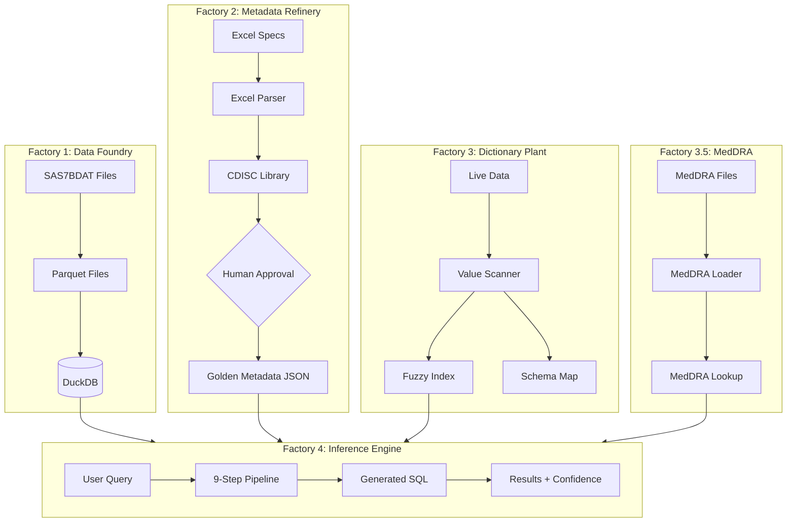
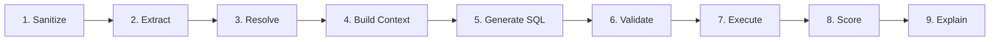
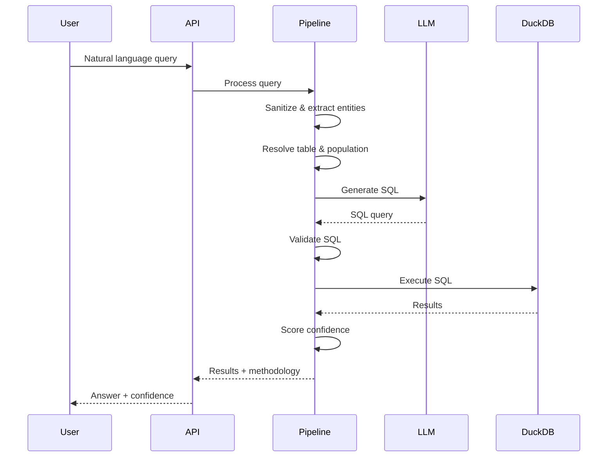

# Architecture Overview

SAGE uses a **Four Factories Model** to transform raw clinical trial data into natural language query results.

---

## The Four Factories



---

## Factory 1: Data Foundry

**Purpose:** Transform raw clinical data files into a queryable database.

| Input | Processing | Output |
|-------|------------|--------|
| SAS7BDAT files | SAS Reader → Parquet conversion | DuckDB database |

### Key Components

- **SASReader**: Reads SAS7BDAT files using `pyreadstat`
- **DuckDBLoader**: Loads Parquet files into DuckDB
- **SchemaTracker**: Tracks table versions and changes

### Supported Datasets

| Type | Common Tables |
|------|--------------|
| **SDTM** | DM, AE, CM, LB, VS, EX, MH |
| **ADaM** | ADSL, ADAE, ADLB, ADTTE, ADEFF |

[Detailed Factory 1 documentation →](../factories/factory1-data/overview.md)

---

## Factory 2: Metadata Refinery

**Purpose:** Transform Excel specifications into structured metadata with human oversight.

| Input | Processing | Output |
|-------|------------|--------|
| Excel specs | Parse → CDISC enrich → Approve | Golden Metadata JSON |

### Key Components

- **ExcelParser**: Parses SDTM/ADaM specification files
- **CDISCLibrary**: Enriches with CDISC Controlled Terminology
- **ApprovalWorkflow**: Human-in-the-loop validation
- **MetadataStore**: Stores approved metadata

### Human-in-the-Loop

!!! important "Approval Required"
    All metadata mappings require human approval before use. This ensures accuracy and audit compliance.

[Detailed Factory 2 documentation →](../factories/factory2-metadata/overview.md)

---

## Factory 3: Dictionary Plant

**Purpose:** Build fuzzy matching indexes from live data.

| Input | Processing | Output |
|-------|------------|--------|
| DuckDB data | Value scanning → Index building | Fuzzy indexes |

### Key Components

- **ValueScanner**: Profiles unique values in each column
- **FuzzyMatcher**: RapidFuzz-based term matching
- **SchemaMapper**: Maps columns to concepts

### Fuzzy Matching Capabilities

- Handles typos: `Tyleonl` → `TYLENOL`
- Resolves synonyms: `headache` → `HEADACHE`
- UK/US spellings: `anaemia` → `ANAEMIA`, `ANEMIA`

[Detailed Factory 3 documentation →](../factories/factory3-dictionary/overview.md)

---

## Factory 3.5: MedDRA Integration

**Purpose:** Provide medical terminology hierarchy support.

| Input | Processing | Output |
|-------|------------|--------|
| MedDRA files | Loader → Hierarchy builder | MedDRA Lookup |

### Hierarchy Levels

```
System Organ Class (SOC)
  └── High Level Group Term (HLGT)
      └── High Level Term (HLT)
          └── Preferred Term (PT)
              └── Lowest Level Term (LLT)
```

[Detailed Factory 3.5 documentation →](../factories/factory35-meddra/overview.md)

---

## Factory 4: Inference Engine

**Purpose:** Process natural language queries and return structured results.

### The 9-Step Pipeline



| Step | Component | Purpose |
|------|-----------|---------|
| 1 | InputSanitizer | Block PHI/PII, SQL injection |
| 2 | EntityExtractor | Extract clinical terms |
| 3 | TableResolver | Select table, apply clinical rules |
| 4 | ContextBuilder | Prepare LLM context |
| 5 | SQLGenerator | Generate DuckDB SQL |
| 6 | SQLValidator | Validate SQL safety |
| 7 | Executor | Execute against DuckDB |
| 8 | ConfidenceScorer | Calculate confidence |
| 9 | ExplanationGenerator | Build human response |

[Detailed Factory 4 documentation →](../factories/factory4-engine/overview.md)

---

## Data Flow



---

## Design Principles

### 1. AI as Translator

The AI translates natural language to SQL. It does **not** perform calculations:

```
User: "What is the average age?"

AI translates to: SELECT AVG(AGE) FROM ADSL

DuckDB calculates: 54.3
```

### 2. Deterministic Execution

All calculations are performed by DuckDB, ensuring reproducible results.

### 3. Transparency

Every answer includes:

- The SQL query executed
- The table and columns used
- Any assumptions made
- A confidence score

### 4. Security First

- PHI/PII detection and blocking
- SQL injection prevention
- Read-only database access
- Full audit logging

---

## Next Steps

- [Data Flow Details](data-flow.md)
- [Security Model](security-model.md)
- [Technology Stack](technology-stack.md)
