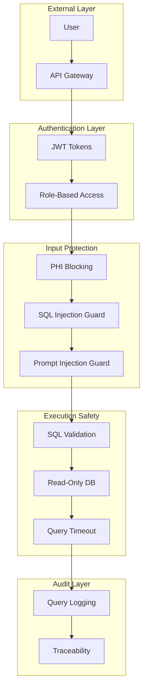

# Security Model

SAGE implements defense-in-depth security for handling sensitive clinical trial data.

---

## Security Architecture



---

## Layer 1: Authentication

### JWT Token Authentication

All API requests require valid JWT tokens:

```python
# Token structure
{
    "sub": "user_id",
    "roles": ["analyst", "admin"],
    "exp": "2024-12-31T23:59:59Z",
    "iat": "2024-01-01T00:00:00Z"
}
```

### Configuration

```env
JWT_SECRET_KEY=your-secret-key-here
JWT_ALGORITHM=HS256
ACCESS_TOKEN_EXPIRE_HOURS=24
```

### Role-Based Access Control (RBAC)

| Role | Permissions |
|------|-------------|
| **viewer** | Read-only query access |
| **analyst** | Query access + export |
| **admin** | Full access + configuration |

---

## Layer 2: Input Protection

### PHI/PII Blocking

SAGE detects and blocks personally identifiable information:

```python
# Blocked patterns
PHI_PATTERNS = [
    r'\b\d{3}-\d{2}-\d{4}\b',     # SSN
    r'\b[A-Z]{2}\d{6}\b',          # Subject IDs (if configured)
    r'\b\d{3}-\d{3}-\d{4}\b',     # Phone numbers
    r'\b[\w.+-]+@[\w-]+\.[\w.-]+\b',  # Email addresses
]
```

**Implementation:** `core/engine/input_sanitizer.py`

!!! danger "Blocked Query Example"
    ```
    User: "Show data for patient John Smith SSN 123-45-6789"

    SAGE: Query blocked - contains protected health information.
          Please rephrase without personal identifiers.
    ```

### SQL Injection Prevention

Multi-layer SQL injection protection:

1. **Pattern Detection**: Blocks common injection patterns
2. **Query Parsing**: Validates SQL syntax
3. **Parameterization**: Never concatenates user input into SQL

```python
# Blocked patterns
DANGEROUS_PATTERNS = [
    r';\s*DROP\s+',
    r';\s*DELETE\s+',
    r'UNION\s+SELECT',
    r'--\s*$',
    r'/\*.*\*/',
]
```

**Implementation:** `core/engine/sql_validator.py`

### Prompt Injection Prevention

Prevents attempts to manipulate the LLM:

```python
# Blocked patterns
PROMPT_INJECTION_PATTERNS = [
    r'ignore\s+(previous|above)\s+instructions',
    r'disregard\s+.*instructions',
    r'you\s+are\s+now\s+',
    r'pretend\s+to\s+be\s+',
]
```

---

## Layer 3: SQL Validation

### Pre-Execution Checks

Before any SQL runs, it must pass:

| Check | Description |
|-------|-------------|
| **Syntax Valid** | Parses without errors |
| **Tables Exist** | All referenced tables are real |
| **Columns Exist** | All referenced columns are real |
| **Read-Only** | No INSERT, UPDATE, DELETE, DROP |
| **No Subversions** | No dangerous patterns |

### Dangerous Operation Blocking

```python
BLOCKED_OPERATIONS = [
    'INSERT', 'UPDATE', 'DELETE', 'DROP',
    'CREATE', 'ALTER', 'TRUNCATE', 'GRANT',
    'EXECUTE', 'EXEC', 'CALL'
]
```

### Table Verification

```python
def verify_tables(sql: str, available_tables: List[str]) -> bool:
    """Verify all tables in SQL exist in schema."""
    parsed = sqlglot.parse_one(sql)
    for table in parsed.find_all(exp.Table):
        if table.name.upper() not in available_tables:
            return False
    return True
```

---

## Layer 4: Execution Safety

### Read-Only Database Connection

DuckDB connection is explicitly read-only:

```python
connection = duckdb.connect(
    database=db_path,
    read_only=True  # Cannot modify data
)
```

### Query Timeout

All queries have enforced time limits:

```python
QUERY_TIMEOUT_SECONDS = 30  # Default

# Execution with timeout
try:
    result = connection.execute(sql)
    # ... handle result
except TimeoutError:
    return "Query timed out after 30 seconds"
```

### Result Limits

```python
MAX_RESULT_ROWS = 10000  # Prevent memory exhaustion
```

---

## Layer 5: Audit Trail

### Query Logging

Every query is logged with full traceability:

```python
audit_record = {
    "timestamp": "2024-01-15T10:30:00Z",
    "user_id": "analyst_001",
    "session_id": "sess_abc123",
    "query": "How many subjects had headache?",
    "sql_generated": "SELECT COUNT...",
    "result_count": 45,
    "confidence_score": 97,
    "execution_time_ms": 150
}
```

**Storage:** `logs/audit/`

### Compliance Fields

| Field | Purpose |
|-------|---------|
| `timestamp` | When query occurred |
| `user_id` | Who ran the query |
| `session_id` | Conversation context |
| `query` | Original natural language |
| `sql_generated` | Actual SQL executed |
| `tables_accessed` | Data sources used |
| `result_count` | Number of rows returned |
| `confidence_score` | Answer reliability |

---

## Security Configuration

### Environment Variables

```env
# Authentication
JWT_SECRET_KEY=<strong-random-key>
JWT_ALGORITHM=HS256
ACCESS_TOKEN_EXPIRE_HOURS=24

# Protection
ENABLE_PHI_BLOCKING=true
ENABLE_SQL_INJECTION_CHECK=true
ENABLE_PROMPT_INJECTION_CHECK=true

# Execution
ALLOW_WRITE_OPERATIONS=false
QUERY_TIMEOUT_SECONDS=30
MAX_RESULT_ROWS=10000
```

### Production Checklist

- [ ] JWT_SECRET_KEY is unique and secure
- [ ] All blocking features are enabled
- [ ] ALLOW_WRITE_OPERATIONS is false
- [ ] Audit logging is configured
- [ ] Network isolation is in place
- [ ] TLS/SSL is enabled (reverse proxy)

---

## Threat Mitigation

| Threat | Mitigation |
|--------|------------|
| **Unauthorized Access** | JWT authentication, RBAC |
| **PHI Exposure** | PHI pattern blocking |
| **SQL Injection** | Pattern detection, validation |
| **Prompt Injection** | Pattern detection |
| **Data Modification** | Read-only database |
| **Resource Exhaustion** | Timeouts, result limits |
| **Audit Evasion** | Mandatory query logging |

---

## Compliance

SAGE security model supports:

- **GAMP 5**: Category 4 validation
- **21 CFR Part 11**: Audit trails
- **GxP**: Data integrity controls

See [Compliance Documentation](../compliance/validation-summary.md) for details.

---

## Next Steps

- [Technology Stack](technology-stack.md)
- [Access Controls](../compliance/access-controls.md)
- [Audit Trail](../compliance/audit-trail.md)
