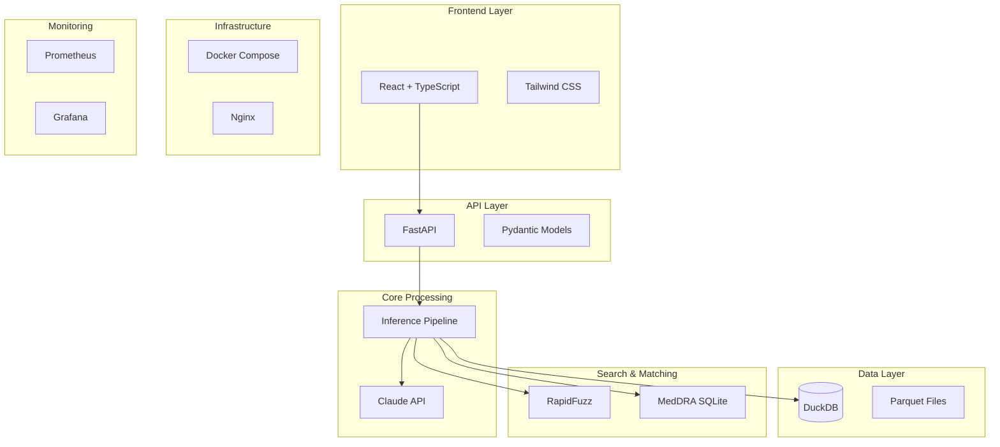

# Technology Stack

SAGE is built on modern, proven technologies optimized for clinical data processing.

---

## Architecture Diagram



---

## Core Components

### AI/LLM: Claude API

| Property | Value |
|----------|-------|
| **Provider** | Anthropic |
| **Model** | claude-sonnet-4-20250514 |
| **Purpose** | Natural language → SQL translation |
| **Temperature** | 0 (deterministic) |

**Why Claude?**

- Excellent SQL generation capabilities
- Low hallucination rate
- Fast response times
- Enterprise-grade reliability

### Database: DuckDB

| Property | Value |
|----------|-------|
| **Type** | Embedded OLAP database |
| **Format** | Columnar storage |
| **Mode** | Read-only |
| **File** | `clinical.duckdb` |

**Why DuckDB?**

- Blazing fast analytical queries
- No server required
- Native Parquet support
- SQL standard compliant

```python
# Example: Sub-second query on millions of rows
SELECT COUNT(DISTINCT USUBJID) FROM ADAE WHERE SAFFL='Y'
# Execution: 50ms
```

### Fuzzy Matching: RapidFuzz

| Property | Value |
|----------|-------|
| **Library** | RapidFuzz |
| **Algorithm** | Levenshtein distance |
| **Speed** | C++ optimized |

**Why RapidFuzz?**

- 10-100x faster than alternatives
- Handles medical terminology well
- Configurable thresholds

```python
# Matches despite typo
fuzzy_match("Tyleonl") → "TYLENOL" (score: 91%)
```

---

## API Layer

### FastAPI

| Property | Value |
|----------|-------|
| **Framework** | FastAPI |
| **Python** | 3.11+ |
| **Async** | Full async/await support |
| **Docs** | Auto-generated OpenAPI |

**Why FastAPI?**

- High performance
- Automatic validation
- Built-in OpenAPI docs
- Type hints throughout

### Pydantic

Used for all data models:

```python
class QueryRequest(BaseModel):
    query: str
    session_id: Optional[str] = None
    include_sql: bool = True

class QueryResponse(BaseModel):
    success: bool
    answer: str
    confidence: ConfidenceScore
    methodology: QueryMethodology
    sql: Optional[str] = None
```

---

## Frontend

### React + TypeScript

| Property | Value |
|----------|-------|
| **Framework** | React 18 |
| **Language** | TypeScript |
| **Build** | Vite |
| **Styling** | Tailwind CSS |

**Key Components:**

- Chat interface with streaming
- Confidence score badges
- SQL viewer with syntax highlighting
- Admin dashboard

### UI Libraries

| Library | Purpose |
|---------|---------|
| **Tailwind CSS** | Utility-first styling |
| **Lucide React** | Icons |
| **React Query** | API state management |
| **React Router** | Navigation |

---

## Infrastructure

### Docker Compose

All services orchestrated via Docker Compose:

```yaml
services:
  api:        # FastAPI backend
  ui:         # React frontend
  docs:       # MkDocs documentation
  prometheus: # Metrics collection
  grafana:    # Monitoring dashboards
```

### Nginx

Reverse proxy for:

- SSL termination
- Static file serving
- Load balancing (if needed)

### Container Images

| Service | Base Image |
|---------|------------|
| API | python:3.11-slim |
| UI | node:20-alpine (build) + nginx:alpine |
| Docs | squidfunk/mkdocs-material |

---

## Monitoring

### Prometheus

Collects metrics:

- Query latency
- Error rates
- Confidence score distribution
- API request counts

### Grafana

Pre-configured dashboards:

- System health
- Query performance
- User activity
- Error analysis

---

## Data Processing

### Parquet Files

Intermediate storage format:

| Property | Value |
|----------|-------|
| **Format** | Apache Parquet |
| **Compression** | Snappy |
| **Schema** | Self-describing |

**Benefits:**

- 10x smaller than CSV
- Column pruning (read only needed columns)
- Predicate pushdown

### SAS Reader

```python
import pyreadstat

df, meta = pyreadstat.read_sas7bdat(
    "data/raw/adsl.sas7bdat"
)
```

---

## Medical Terminology

### MedDRA Integration

| Property | Value |
|----------|-------|
| **Storage** | SQLite |
| **Hierarchy** | SOC → HLGT → HLT → PT → LLT |
| **Version** | Configurable |

### Medical Synonyms

Built-in dictionary for:

- UK/US spellings (anaemia/anemia)
- Colloquial terms (belly pain → ABDOMINAL PAIN)
- Complex phrases (low blood cell count → WBC DECREASED)

---

## Documentation

### MkDocs Material

| Property | Value |
|----------|-------|
| **Theme** | Material for MkDocs |
| **Features** | Search, dark mode, code highlighting |
| **Diagrams** | Mermaid support |

---

## Version Requirements

### Python Packages

```txt
fastapi>=0.100.0
pydantic>=2.0.0
duckdb>=0.9.0
anthropic>=0.20.0
rapidfuzz>=3.0.0
pyreadstat>=1.2.0
pandas>=2.0.0
```

### System Requirements

| Component | Minimum | Recommended |
|-----------|---------|-------------|
| Python | 3.11 | 3.12 |
| Docker | 24.0 | Latest |
| RAM | 16 GB | 32+ GB |
| Storage | 50 GB SSD | 200+ GB SSD |

---

## Performance Characteristics

| Operation | Typical Time |
|-----------|-------------|
| Query sanitization | <10ms |
| Entity extraction | <50ms |
| SQL generation (Claude) | 500-2000ms |
| SQL execution (DuckDB) | 10-500ms |
| **Total query time** | **1-3 seconds** |

### Optimization Features

- Query caching
- Connection pooling
- Lazy loading of indexes
- Result pagination

---

## Next Steps

- [Architecture Overview](overview.md)
- [Data Flow](data-flow.md)
- [Security Model](security-model.md)
