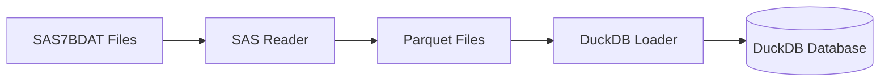

# Factory 1: Data Foundry

Factory 1 transforms raw clinical trial data files into a queryable DuckDB database.

---

## Purpose

The Data Foundry ingests SAS7BDAT files from clinical trials and:

1. Reads SAS format data
2. Converts to efficient Parquet format
3. Loads into DuckDB for fast querying



---

## Components

| Component | File | Purpose |
|-----------|------|---------|
| **SASReader** | `sas_reader.py` | Read SAS7BDAT files |
| **DuckDBLoader** | `duckdb_loader.py` | Load into DuckDB |
| **SchemaTracker** | `schema_tracker.py` | Track schema versions |

---

## Supported Data Types

### SDTM Domains

| Domain | Description |
|--------|-------------|
| DM | Demographics |
| AE | Adverse Events |
| CM | Concomitant Medications |
| LB | Laboratory |
| VS | Vital Signs |
| EX | Exposure |
| MH | Medical History |

### ADaM Datasets

| Dataset | Description |
|---------|-------------|
| ADSL | Subject Level |
| ADAE | Adverse Events Analysis |
| ADLB | Laboratory Analysis |
| ADTTE | Time-to-Event |
| ADEFF | Efficacy |

---

## Usage

### Running Factory 1

```bash
# Load all data files
python scripts/factory1_data.py

# Load specific file
python scripts/factory1_data.py --file data/raw/adsl.sas7bdat
```

### Directory Structure

```
data/
├── raw/           # Place SAS7BDAT files here
│   ├── adsl.sas7bdat
│   ├── adae.sas7bdat
│   └── ...
├── processed/     # Parquet files (auto-generated)
│   ├── ADSL.parquet
│   ├── ADAE.parquet
│   └── ...
└── database/      # DuckDB database
    └── clinical.duckdb
```

---

## Processing Pipeline

### Step 1: File Discovery

```python
from pathlib import Path

raw_dir = Path("data/raw")
sas_files = list(raw_dir.glob("*.sas7bdat"))
```

### Step 2: SAS Reading

```python
from core.data.sas_reader import SASReader

reader = SASReader()
df, metadata = reader.read("data/raw/adsl.sas7bdat")
```

### Step 3: Parquet Conversion

```python
# Save as Parquet with compression
df.to_parquet(
    "data/processed/ADSL.parquet",
    compression="snappy"
)
```

### Step 4: DuckDB Loading

```python
from core.data.duckdb_loader import DuckDBLoader

loader = DuckDBLoader("data/database/clinical.duckdb")
loader.load_parquet("data/processed/ADSL.parquet", "ADSL")
```

---

## Data Type Handling

### Automatic Conversions

| SAS Type | Python Type | DuckDB Type |
|----------|-------------|-------------|
| Character | str | VARCHAR |
| Numeric | float64 | DOUBLE |
| Date | datetime | DATE |
| DateTime | datetime | TIMESTAMP |

### Special Cases

**Missing Values:**
- SAS `.` → Python `None` → DuckDB `NULL`

**Date Handling:**
- SAS dates (days since 1960-01-01) → Python datetime
- SAS datetime → Python datetime with time component

---

## Schema Tracking

Factory 1 tracks schema changes for audit compliance:

```python
from core.data.schema_tracker import SchemaTracker

tracker = SchemaTracker("data/database/schema_versions.json")

# Record new table version
tracker.record_load(
    table_name="ADSL",
    columns=["USUBJID", "AGE", "SEX", ...],
    row_count=233,
    file_hash="abc123..."
)
```

### Version History

```json
{
  "ADSL": {
    "versions": [
      {
        "timestamp": "2024-01-15T10:30:00Z",
        "columns": ["USUBJID", "AGE", "SEX"],
        "row_count": 233,
        "file_hash": "abc123..."
      }
    ]
  }
}
```

---

## Error Handling

### Common Errors

| Error | Cause | Solution |
|-------|-------|----------|
| `FileNotFoundError` | SAS file missing | Check file path |
| `SAS7BDATReadError` | Corrupt SAS file | Re-export from SAS |
| `DuckDBError` | Schema mismatch | Check column names |

### Validation

```python
# Verify load succeeded
result = loader.execute("SELECT COUNT(*) FROM ADSL")
assert result[0][0] > 0, "Table is empty"
```

---

## Configuration

### Environment Variables

```env
# Data paths
RAW_DATA_PATH=/app/data/raw
PROCESSED_DATA_PATH=/app/data/processed
DUCKDB_PATH=/app/data/database/clinical.duckdb

# Processing options
PARQUET_COMPRESSION=snappy
ENABLE_SCHEMA_TRACKING=true
```

---

## Best Practices

1. **File Naming**: Use uppercase table names (ADSL.sas7bdat)
2. **Incremental Loads**: Re-run Factory 1 after data updates
3. **Backup**: Keep original SAS files in version control
4. **Validation**: Verify row counts match source

---

## Next Steps

- [SAS Reader Details](sas-reader.md)
- [DuckDB Loader Details](duckdb-loader.md)
- [Schema Tracker Details](schema-tracker.md)
- [API Reference](api-reference.md)
