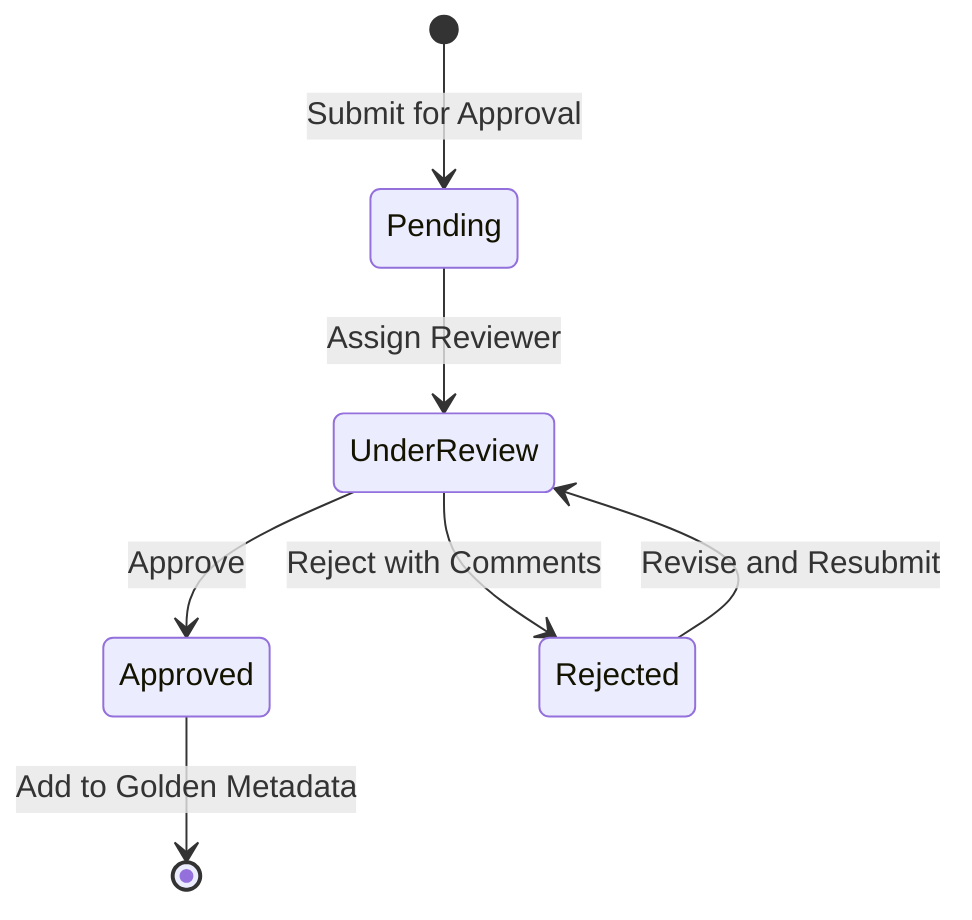

# Approval Workflow

The Approval Workflow manages human-in-the-loop validation of metadata mappings.

---

## Overview

**File:** `core/metadata/approval_workflow.py`

**Class:** `ApprovalWorkflow`

**Purpose:** Ensure all metadata is human-approved before use

---

## Why Human Approval?

Clinical data systems require human oversight for:

1. **Accuracy**: Verify parsed data is correct
2. **Compliance**: Meet GxP audit requirements
3. **Accountability**: Track who approved what
4. **Quality**: Catch parsing errors

---

## Workflow States



| State | Description | Actions Available |
|-------|-------------|-------------------|
| **Pending** | Awaiting review | Assign reviewer |
| **Under Review** | Being reviewed | Approve, Reject |
| **Approved** | Ready for use | Export |
| **Rejected** | Needs revision | Revise, Resubmit |

---

## Usage

### Submit for Approval

```python
from core.metadata.approval_workflow import ApprovalWorkflow

workflow = ApprovalWorkflow()

# Submit parsed metadata
submission_id = workflow.submit(
    metadata=parsed_metadata,
    submitter="analyst@example.com",
    description="SDTM spec version 2.0"
)
```

### Review and Approve

```python
# Get pending submissions
pending = workflow.get_pending()

# Review specific submission
submission = workflow.get_submission(submission_id)

# Approve
workflow.approve(
    submission_id=submission_id,
    reviewer="reviewer@example.com",
    comments="Looks correct"
)

# Or reject
workflow.reject(
    submission_id=submission_id,
    reviewer="reviewer@example.com",
    comments="Missing AESEV definition"
)
```

---

## API Reference

### ApprovalWorkflow Class

```python
class ApprovalWorkflow:
    def __init__(self, storage_path: str = "approvals.db"):
        """Initialize workflow with storage."""

    def submit(
        self,
        metadata: Dict,
        submitter: str,
        description: str = ""
    ) -> str:
        """
        Submit metadata for approval.

        Args:
            metadata: Parsed metadata to approve
            submitter: Email of submitter
            description: Description of submission

        Returns:
            Submission ID
        """

    def approve(
        self,
        submission_id: str,
        reviewer: str,
        comments: str = ""
    ) -> None:
        """
        Approve a submission.

        Args:
            submission_id: ID of submission
            reviewer: Email of reviewer
            comments: Approval comments
        """

    def reject(
        self,
        submission_id: str,
        reviewer: str,
        comments: str
    ) -> None:
        """
        Reject a submission.

        Args:
            submission_id: ID of submission
            reviewer: Email of reviewer
            comments: Required rejection reason
        """

    def get_pending(self) -> List[Dict]:
        """Get all pending submissions."""

    def get_submission(self, submission_id: str) -> Dict:
        """Get specific submission details."""

    def get_history(
        self,
        submission_id: Optional[str] = None,
        limit: int = 100
    ) -> List[Dict]:
        """Get approval history."""
```

---

## Submission Record

```json
{
  "id": "sub_20240115_001",
  "status": "under_review",
  "metadata": {
    "domains": {...},
    "variables": {...}
  },
  "submitter": "analyst@example.com",
  "submitted_at": "2024-01-15T10:30:00Z",
  "reviewer": "reviewer@example.com",
  "assigned_at": "2024-01-15T11:00:00Z",
  "description": "SDTM spec version 2.0",
  "history": [
    {
      "action": "submit",
      "user": "analyst@example.com",
      "timestamp": "2024-01-15T10:30:00Z"
    },
    {
      "action": "assign",
      "user": "admin@example.com",
      "timestamp": "2024-01-15T11:00:00Z",
      "details": {"reviewer": "reviewer@example.com"}
    }
  ]
}
```

---

## Admin UI Integration

The approval workflow integrates with the Admin UI:

### Pending Approvals View

- List all pending submissions
- Filter by submitter, date, type
- Assign reviewers

### Review View

- Side-by-side comparison with source
- Variable-by-variable review
- Approve/Reject buttons
- Comment field

### History View

- Complete audit trail
- Export to PDF for compliance

---

## Audit Trail

Every action is logged:

```json
{
  "timestamp": "2024-01-15T14:30:00Z",
  "action": "approve",
  "submission_id": "sub_20240115_001",
  "user": "reviewer@example.com",
  "comments": "All variables verified correct",
  "ip_address": "192.168.1.100"
}
```

---

## Notifications

Configure email notifications:

```python
workflow = ApprovalWorkflow(
    notifications={
        "on_submit": ["admins@example.com"],
        "on_approve": ["submitter"],  # Notify original submitter
        "on_reject": ["submitter"]
    }
)
```

---

## Bulk Operations

### Bulk Approval

For trusted sources, approve multiple at once:

```python
# Only available to admins
workflow.bulk_approve(
    submission_ids=["sub_001", "sub_002"],
    reviewer="admin@example.com",
    comments="Bulk approval of validated specs"
)
```

### Expiration

Pending submissions expire after configured time:

```python
# Check for expired submissions
expired = workflow.get_expired(days=30)
for submission in expired:
    workflow.expire(submission["id"])
```

---

## Configuration

### Environment Variables

```env
# Approval settings
REQUIRE_APPROVAL=true
APPROVAL_TIMEOUT_DAYS=30
AUTO_ASSIGN_REVIEWER=false

# Notifications
SMTP_HOST=smtp.example.com
NOTIFICATION_FROM=sage@example.com
```

---

## Best Practices

1. **Timely Review**: Review submissions within SLA
2. **Detailed Comments**: Provide clear feedback
3. **Separation of Duties**: Different submitter and reviewer
4. **Complete Review**: Check all variables
5. **Document Decisions**: Record rationale for approvals

---

## Next Steps

- [CDISC Integration](cdisc-integration.md)
- [Factory 2 Overview](overview.md)
- [Compliance Documentation](../../compliance/audit-trail.md)
