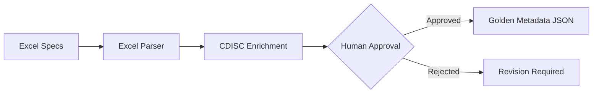
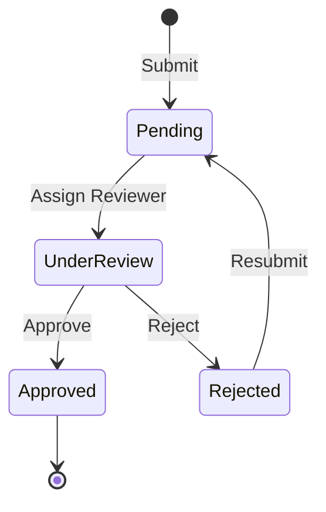

# Factory 2: Metadata Refinery

Factory 2 transforms Excel specification files into structured Golden Metadata with human oversight.

---

## Purpose

The Metadata Refinery processes clinical trial specifications and:

1. Parses Excel specification files
2. Enriches with CDISC Controlled Terminology
3. Requires human approval for each mapping
4. Produces Golden Metadata JSON



---

## Human-in-the-Loop

!!! important "Approval Required"
    All metadata mappings require human approval before use. This ensures:

    - Accuracy of variable definitions
    - Correct interpretation of specifications
    - Audit compliance for GxP systems

---

## Components

| Component | File | Purpose |
|-----------|------|---------|
| **ExcelParser** | `excel_parser.py` | Parse specification files |
| **CDISCLibrary** | `cdisc_library.py` | CDISC terminology lookup |
| **MetadataStore** | `metadata_store.py` | Store approved metadata |
| **ApprovalWorkflow** | `approval_workflow.py` | Manage human approvals |

---

## Supported Specification Formats

### SDTM Specifications

| Sheet | Content |
|-------|---------|
| Domains | Domain list and descriptions |
| Variables | Variable definitions |
| Codelists | Controlled terminology |
| Value Level | Conditional definitions |

### ADaM Specifications

| Sheet | Content |
|-------|---------|
| Datasets | Dataset list |
| Variables | Variable definitions |
| Analysis Results | Results metadata |

---

## Usage

### Running Factory 2

```bash
# Parse all specification files
python scripts/factory2_metadata.py

# Parse specific file
python scripts/factory2_metadata.py --file specs/raw/sdtm_spec.xlsx
```

### Directory Structure

```
specs/
├── raw/                    # Place Excel specs here
│   ├── sdtm_spec.xlsx
│   └── adam_spec.xlsx
└── processed/              # Parsed specifications
    └── parsed_specs.json

knowledge/
└── golden_metadata.json    # Approved metadata
```

---

## Processing Pipeline

### Step 1: Parse Excel

```python
from core.metadata.excel_parser import ExcelParser

parser = ExcelParser()
raw_metadata = parser.parse("specs/raw/sdtm_spec.xlsx")
```

### Step 2: CDISC Enrichment

```python
from core.metadata.cdisc_library import CDISCLibrary

cdisc = CDISCLibrary()
enriched = cdisc.enrich(raw_metadata)
```

### Step 3: Human Approval

Via Admin UI or API:

```python
from core.metadata.approval_workflow import ApprovalWorkflow

workflow = ApprovalWorkflow()
workflow.submit_for_approval(enriched)
# User reviews in Admin UI
# workflow.approve(variable_id, user_id)
```

### Step 4: Store Approved Metadata

```python
from core.metadata.metadata_store import MetadataStore

store = MetadataStore("knowledge/golden_metadata.json")
store.add_approved(approved_metadata)
```

---

## Golden Metadata Structure

```json
{
  "version": "1.0",
  "created": "2024-01-15T10:30:00Z",
  "approved_by": "user@example.com",
  "domains": {
    "ADAE": {
      "description": "Adverse Events Analysis Dataset",
      "variables": {
        "USUBJID": {
          "label": "Unique Subject Identifier",
          "type": "character",
          "length": 20,
          "description": "Identifier used to uniquely identify a subject",
          "cdisc_term": "USUBJID",
          "required": true
        },
        "AEDECOD": {
          "label": "Dictionary-Derived Term",
          "type": "character",
          "length": 200,
          "description": "Dictionary-derived text for adverse event",
          "codelist": "MEDDRA_PT",
          "required": true
        }
      }
    }
  }
}
```

---

## Approval Workflow States



| State | Description |
|-------|-------------|
| **Pending** | Awaiting reviewer assignment |
| **Under Review** | Reviewer examining |
| **Approved** | Ready for use |
| **Rejected** | Needs revision |

---

## Error Handling

### Common Errors

| Error | Cause | Solution |
|-------|-------|----------|
| `ParseError` | Invalid Excel format | Check file structure |
| `CDISCLookupError` | Term not in CDISC | Use custom definition |
| `ValidationError` | Missing required fields | Complete specification |

---

## Configuration

### Environment Variables

```env
# Paths
SPECS_PATH=/app/specs/raw
METADATA_PATH=/app/knowledge/golden_metadata.json

# CDISC Library
CDISC_LIBRARY_PATH=/app/knowledge/cdisc_library.db

# Approval Settings
REQUIRE_APPROVAL=true
APPROVAL_TIMEOUT_DAYS=7
```

---

## Best Practices

1. **Complete Specifications**: Ensure all variables are defined
2. **Standard Formats**: Follow CDISC naming conventions
3. **Review Carefully**: Incorrect metadata affects query accuracy
4. **Version Control**: Keep Excel files in version control
5. **Audit Trail**: Document all approval decisions

---

## Next Steps

- [Excel Parser Details](excel-parser.md)
- [CDISC Integration](cdisc-integration.md)
- [Approval Workflow](approval-workflow.md)
- [API Reference](api-reference.md)
