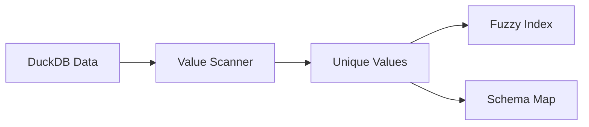

# Factory 3: Dictionary Plant

Factory 3 builds fuzzy matching indexes from live clinical data for term resolution.

---

## Purpose

The Dictionary Plant creates search indexes that enable:

1. Typo correction: `Tyleonl` → `TYLENOL`
2. Synonym resolution: `headache` → `HEADACHE`
3. Fuzzy matching: `nausea` → `NAUSEA` (93% match)



---

## Components

| Component | File | Purpose |
|-----------|------|---------|
| **FuzzyMatcher** | `fuzzy_matcher.py` | RapidFuzz-based matching |
| **ValueScanner** | `value_scanner.py` | Extract unique values |
| **SchemaMapper** | `schema_mapper.py` | Map columns to concepts |

---

## How It Works

### 1. Scan Data

Extract all unique values from key columns:

```python
# Scan AE terms
unique_terms = scanner.scan_column("ADAE", "AEDECOD")
# ["HEADACHE", "NAUSEA", "FATIGUE", ...]
```

### 2. Build Index

Create RapidFuzz index for fast matching:

```python
# Build fuzzy index
index = matcher.build_index(unique_terms)
```

### 3. Match Terms

Find closest matches for user queries:

```python
# User types "headche" (typo)
matches = matcher.find_matches("headche")
# [("HEADACHE", 94.0, "AEDECOD")]
```

---

## Usage

### Running Factory 3

```bash
# Build all indexes
python scripts/factory3_dictionary.py

# Rebuild specific table
python scripts/factory3_dictionary.py --table ADAE
```

### Output Files

```
knowledge/
├── fuzzy_index.pkl      # Serialized index
├── schema_map.json      # Column mappings
└── value_stats.json     # Value statistics
```

---

## Indexed Columns

### Default Columns

| Table | Column | Purpose |
|-------|--------|---------|
| ADAE | AEDECOD | AE preferred terms |
| ADAE | AETERM | AE verbatim terms |
| ADCM | CMDECOD | Medication names |
| ADLB | LBTESTCD | Lab test codes |
| ADLB | LBTEST | Lab test names |

### Custom Columns

Add columns to index via configuration:

```python
scanner = ValueScanner(config={
    "additional_columns": [
        ("ADAE", "AEBODSYS"),
        ("ADMH", "MHDECOD")
    ]
})
```

---

## Matching Algorithm

### RapidFuzz Scoring

Uses weighted ratio for optimal matching:

```python
from rapidfuzz import fuzz

score = fuzz.WRatio("headche", "HEADACHE")
# 94.0
```

### Match Thresholds

| Score | Quality | Action |
|-------|---------|--------|
| 95-100 | Excellent | Use directly |
| 85-94 | Good | Use with note |
| 70-84 | Fair | Show alternatives |
| <70 | Poor | Request clarification |

---

## Schema Mapping

Maps columns to clinical concepts:

```json
{
  "adverse_event_term": {
    "primary": {"table": "ADAE", "column": "AEDECOD"},
    "fallback": {"table": "AE", "column": "AEDECOD"}
  },
  "medication_name": {
    "primary": {"table": "ADCM", "column": "CMDECOD"},
    "fallback": {"table": "CM", "column": "CMDECOD"}
  }
}
```

---

## Performance

### Index Size

| Records | Index Size | Build Time |
|---------|------------|------------|
| 1,000 | 50 KB | 0.1s |
| 10,000 | 500 KB | 1s |
| 100,000 | 5 MB | 10s |

### Query Speed

```python
# Sub-millisecond matching
matches = matcher.find_matches("nausea")
# Time: 0.3ms
```

---

## Configuration

### Environment Variables

```env
# Index settings
FUZZY_INDEX_PATH=/app/knowledge/fuzzy_index.pkl
MATCH_THRESHOLD=80
MAX_MATCHES=5

# Performance
INDEX_CACHE_SIZE=1000
```

---

## Best Practices

1. **Rebuild After Data Load**: Run Factory 3 after Factory 1
2. **Include All Terms**: Index all searchable columns
3. **Set Appropriate Thresholds**: Balance accuracy vs flexibility
4. **Monitor Index Size**: Large indexes use more memory

---

## Next Steps

- [Fuzzy Matching Details](fuzzy-matching.md)
- [Value Scanning](value-scanning.md)
- [API Reference](api-reference.md)
