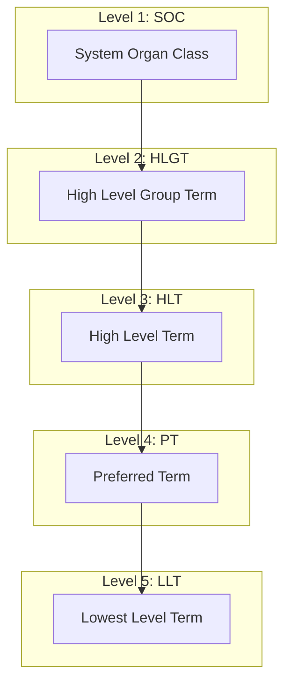

# MedDRA Hierarchy

Understanding the MedDRA terminology hierarchy structure.

---

## Hierarchy Structure

MedDRA organizes medical terminology in a 5-level hierarchy:



---

## Level Descriptions

### System Organ Class (SOC)

The highest level, grouping by body system or etiology:

| SOC | Description |
|-----|-------------|
| Cardiac disorders | Heart conditions |
| Gastrointestinal disorders | Digestive system |
| Nervous system disorders | Brain and nerves |
| Skin and subcutaneous tissue disorders | Skin conditions |
| Infections and infestations | Infectious diseases |

**Total: ~27 SOCs**

### High Level Group Term (HLGT)

Groups related High Level Terms:

```
SOC: Nervous system disorders
├── HLGT: Headaches
├── HLGT: Seizures
├── HLGT: Movement disorders
└── HLGT: Cognitive disorders
```

**Total: ~337 HLGTs**

### High Level Term (HLT)

Groups related Preferred Terms:

```
HLGT: Headaches
├── HLT: Headaches NEC
├── HLT: Migraine headaches
└── HLT: Tension headaches
```

**Total: ~1,737 HLTs**

### Preferred Term (PT)

The standard term for coding adverse events:

```
HLT: Headaches NEC
├── PT: Headache
├── PT: Sinus headache
└── PT: Cluster headache
```

**Total: ~24,000 PTs**

### Lowest Level Term (LLT)

Synonyms and entry terms that map to PTs:

```
PT: Headache
├── LLT: Headache
├── LLT: Cephalalgia
├── LLT: Head pain
├── LLT: Cephalodynia
└── LLT: Cranial pain
```

**Total: ~82,000 LLTs**

---

## Example: Complete Hierarchy

### Headache

```
SOC: Nervous system disorders (10029205)
  └── HLGT: Headaches (10019231)
      └── HLT: Headaches NEC (10019233)
          └── PT: Headache (10019211)
              ├── LLT: Headache (10019211)
              ├── LLT: Cephalalgia (10007836)
              ├── LLT: Head pain (10019196)
              ├── LLT: Cephalodynia (10007837)
              └── LLT: Cranial pain (10011268)
```

### Nausea

```
SOC: Gastrointestinal disorders (10017947)
  └── HLGT: Nausea and vomiting symptoms (10028817)
      └── HLT: Nausea and vomiting symptoms (10028824)
          └── PT: Nausea (10028813)
              ├── LLT: Nausea (10028813)
              ├── LLT: Feeling sick (10016329)
              ├── LLT: Nauseous (10028814)
              └── LLT: Queasy (10037764)
```

---

## Multi-Axial Classification

A PT can appear under multiple SOCs:

```
PT: Headache (10019211)
├── Primary SOC: Nervous system disorders
└── Secondary SOC: General disorders and administration site conditions
```

### Primary vs Secondary

- **Primary SOC**: Main classification (used for primary coding)
- **Secondary SOC**: Additional classification (for alternative grouping)

---

## Navigating the Hierarchy

### Bottom-Up Navigation

```python
from core.meddra.meddra_lookup import MedDRALookup

meddra = MedDRALookup()

# Start with an LLT
llt = "cephalalgia"
hierarchy = meddra.get_hierarchy_from_llt(llt)

# Returns:
{
    "llt": {"code": "10007836", "name": "Cephalalgia"},
    "pt": {"code": "10019211", "name": "Headache"},
    "hlt": {"code": "10019233", "name": "Headaches NEC"},
    "hlgt": {"code": "10019231", "name": "Headaches"},
    "soc": {"code": "10029205", "name": "Nervous system disorders"}
}
```

### Top-Down Navigation

```python
# Get all PTs under a SOC
pts = meddra.get_pts_by_soc("Nervous system disorders")

# Get all LLTs for a PT
llts = meddra.get_llts_by_pt("Headache")
```

---

## Query Patterns

### Find All Terms in a SOC

```sql
SELECT DISTINCT pt.pt_name
FROM pt
JOIN soc ON pt.soc_code = soc.soc_code
WHERE UPPER(soc.soc_name) = 'NERVOUS SYSTEM DISORDERS'
ORDER BY pt.pt_name;
```

### Find PT for an LLT

```sql
SELECT pt.pt_name, pt.pt_code
FROM llt
JOIN pt ON llt.pt_code = pt.pt_code
WHERE UPPER(llt.llt_name) = 'CEPHALALGIA';
```

### Search Terms

```sql
SELECT pt_name, pt_code
FROM pt
WHERE UPPER(pt_name) LIKE 'HEAD%'
ORDER BY pt_name;
```

---

## Clinical Usage

### Coding Adverse Events

1. User reports: "My head hurts"
2. Match to LLT: "Head pain" (10019196)
3. Map to PT: "Headache" (10019211)
4. Store PT code in AEDECOD

### Grouping by SOC

```python
# Count AEs by SOC
sql = """
SELECT soc_name, COUNT(DISTINCT USUBJID) as subjects
FROM ADAE
JOIN meddra_pt ON UPPER(ADAE.AEDECOD) = UPPER(meddra_pt.pt_name)
JOIN meddra_soc ON meddra_pt.soc_code = meddra_soc.soc_code
GROUP BY soc_name
ORDER BY subjects DESC
"""
```

---

## Version Considerations

### Updating MedDRA

MedDRA is updated twice yearly. Changes may include:

- New PTs and LLTs
- Deprecated terms (moved to new hierarchy)
- Modified relationships

### Version Tracking

```python
# Check version
version = meddra.get_version()
# "MedDRA Version 26.0"

# Version history
versions = meddra.get_version_history()
# [{"version": "26.0", "loaded": "2024-01-15"}, ...]
```

---

## Next Steps

- [API Reference](api-reference.md)
- [Factory 3.5 Overview](overview.md)
- [Entity Extraction](../factory4-engine/entity-extractor.md)
