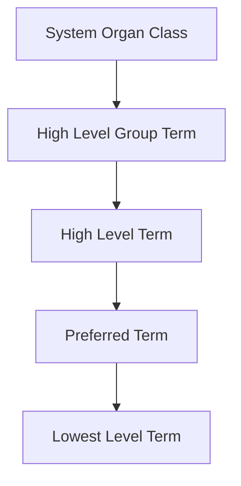

# Factory 3.5: MedDRA Integration

Factory 3.5 provides Medical Dictionary for Regulatory Activities (MedDRA) terminology support.

---

## Purpose

MedDRA is the standard medical terminology for adverse event reporting:

1. Standardized terminology hierarchy
2. Term-to-code mapping
3. Hierarchy navigation (SOC → PT → LLT)



---

## MedDRA Hierarchy

### Levels

| Level | Abbreviation | Count | Example |
|-------|--------------|-------|---------|
| System Organ Class | SOC | ~27 | Nervous system disorders |
| High Level Group Term | HLGT | ~337 | Headaches |
| High Level Term | HLT | ~1,737 | Headaches NEC |
| Preferred Term | PT | ~24,000 | Headache |
| Lowest Level Term | LLT | ~82,000 | Throbbing headache |

### Example Hierarchy

```
SOC: Nervous system disorders
  └── HLGT: Headaches
      └── HLT: Headaches NEC
          └── PT: Headache
              ├── LLT: Headache
              ├── LLT: Cephalalgia
              └── LLT: Head pain
```

---

## Components

| Component | File | Purpose |
|-----------|------|---------|
| **MedDRALoader** | `meddra_loader.py` | Load MedDRA files |
| **MedDRALookup** | `meddra_lookup.py` | Query terminology |

---

## Usage

### Load MedDRA

```bash
# Load MedDRA files
python scripts/load_meddra.py --path meddra_files/
```

### Query Terms

```python
from core.meddra.meddra_lookup import MedDRALookup

meddra = MedDRALookup()

# Lookup by term
result = meddra.lookup("headache")
# {
#   "pt_code": "10019211",
#   "pt_name": "Headache",
#   "soc_name": "Nervous system disorders",
#   "hlt_name": "Headaches NEC"
# }
```

---

## API Reference

### MedDRALookup Class

```python
class MedDRALookup:
    def __init__(self, db_path: str = None):
        """Initialize with database path."""

    def lookup(self, term: str) -> Optional[Dict]:
        """
        Look up a term in MedDRA.

        Args:
            term: Term to look up (case-insensitive)

        Returns:
            Dict with pt_code, pt_name, soc_name, etc.
            or None if not found
        """

    def get_hierarchy(self, pt_code: str) -> Dict:
        """
        Get full hierarchy for a preferred term.

        Returns:
            Dict with soc, hlgt, hlt, pt, llts
        """

    def get_llt_terms(self, pt_code: str) -> List[str]:
        """Get all LLT terms for a PT."""

    def get_pt_by_soc(self, soc_name: str) -> List[str]:
        """Get all PTs under a SOC."""

    def search(
        self,
        query: str,
        level: str = "pt"
    ) -> List[Dict]:
        """
        Search terms by prefix/pattern.

        Args:
            query: Search string
            level: "soc", "pt", or "llt"
        """
```

---

## Data Loading

### MedDRA File Format

MedDRA is distributed as ASCII files:

| File | Content |
|------|---------|
| llt.asc | Lowest Level Terms |
| pt.asc | Preferred Terms |
| hlt.asc | High Level Terms |
| hlgt.asc | High Level Group Terms |
| soc.asc | System Organ Classes |
| hlt_pt.asc | HLT to PT relationships |

### Loading Process

```python
from core.meddra.meddra_loader import MedDRALoader

loader = MedDRALoader()
loader.load_from_files("meddra_files/")
loader.save_database("knowledge/meddra.db")
```

---

## Integration with Factory 4

### Entity Extraction

```python
from core.engine.entity_extractor import EntityExtractor

extractor = EntityExtractor()
result = extractor.extract("How many subjects had cephalalgia?")

# Entity found:
# - original: "cephalalgia"
# - matched: "HEADACHE" (PT via MedDRA LLT lookup)
# - meddra_code: "10019211"
```

### Hierarchy Queries

```python
# Find all AEs under Nervous system disorders
meddra = MedDRALookup()
pts = meddra.get_pt_by_soc("Nervous system disorders")
# ["Headache", "Dizziness", "Migraine", ...]
```

---

## Database Schema

```sql
-- Preferred Terms
CREATE TABLE pt (
    pt_code TEXT PRIMARY KEY,
    pt_name TEXT,
    soc_code TEXT,
    FOREIGN KEY (soc_code) REFERENCES soc(soc_code)
);

-- Lowest Level Terms
CREATE TABLE llt (
    llt_code TEXT PRIMARY KEY,
    llt_name TEXT,
    pt_code TEXT,
    FOREIGN KEY (pt_code) REFERENCES pt(pt_code)
);

-- System Organ Classes
CREATE TABLE soc (
    soc_code TEXT PRIMARY KEY,
    soc_name TEXT
);
```

---

## Performance

### Indexes

```sql
CREATE INDEX idx_llt_name ON llt(UPPER(llt_name));
CREATE INDEX idx_pt_name ON pt(UPPER(pt_name));
CREATE INDEX idx_pt_soc ON pt(soc_code);
```

### Query Times

| Operation | Time |
|-----------|------|
| Lookup by name | <1ms |
| Get hierarchy | <2ms |
| Search by prefix | <10ms |

---

## Configuration

### Environment Variables

```env
# MedDRA database path
MEDDRA_DB_PATH=/app/knowledge/meddra.db

# Version tracking
MEDDRA_VERSION=26.0
```

---

## Version Management

```python
# Check version
version = meddra.get_version()
# "MedDRA Version 26.0"

# Update to new version
loader = MedDRALoader()
loader.load_from_files("meddra_v27/")
loader.save_database("knowledge/meddra.db")
```

---

## Next Steps

- [Hierarchy Details](hierarchy.md)
- [API Reference](api-reference.md)
- [Factory 4 Integration](../factory4-engine/entity-extractor.md)
