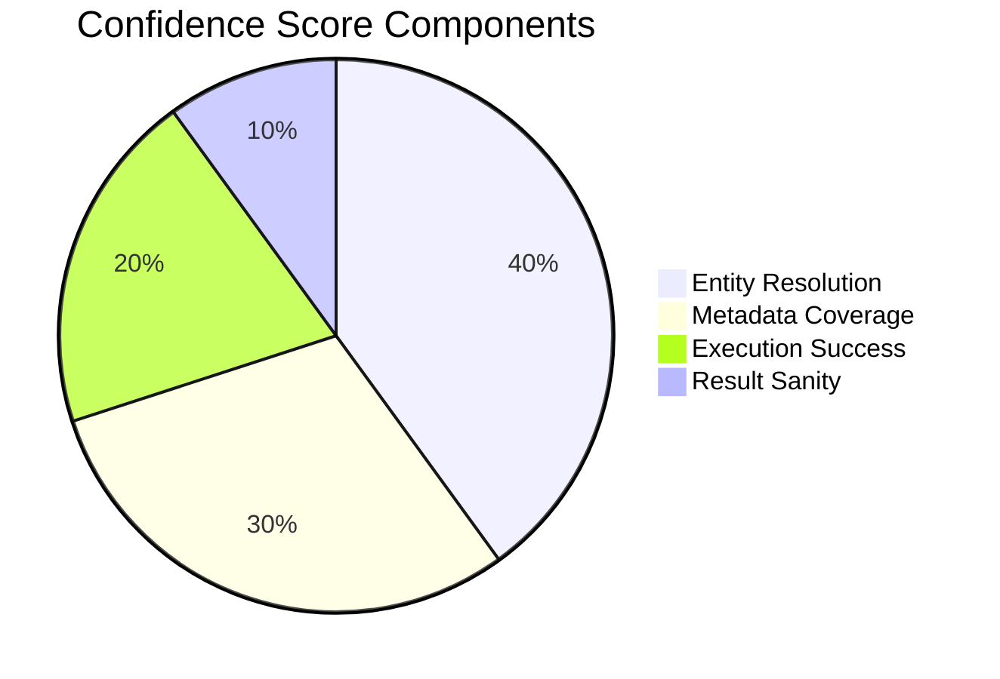

# Confidence Scorer

The Confidence Scorer calculates how reliable an answer is based on multiple factors.

---

## Overview

**File:** `core/engine/confidence_scorer.py`

**Class:** `ConfidenceScorer`

**Purpose:** Provide transparency about answer reliability

---

## Why Confidence Scoring?

Clinical data queries need reliability indicators:

- Users need to know when to trust results
- Auditors need traceability
- Low confidence triggers review

---

## Score Components



| Component | Weight | Measures |
|-----------|--------|----------|
| **Entity Resolution** | 40% | How well user terms matched data |
| **Metadata Coverage** | 30% | How well columns are documented |
| **Execution Success** | 20% | Query executed without errors |
| **Result Sanity** | 10% | Results are reasonable |

---

## Component Details

### Entity Resolution (40%)

Measures how confidently we matched user terms to data:

| Scenario | Score |
|----------|-------|
| Exact match | 100% |
| High fuzzy match (>95%) | 95% |
| Good fuzzy match (85-95%) | 85% |
| Fair fuzzy match (70-85%) | 70% |
| Low match (<70%) | 50% |
| No match needed | 100% |

### Metadata Coverage (30%)

Measures how well queried columns are documented:

| Scenario | Score |
|----------|-------|
| All columns in Golden Metadata | 100% |
| Most columns documented (>80%) | 90% |
| Some columns documented (50-80%) | 70% |
| Few columns documented (<50%) | 50% |

### Execution Success (20%)

Measures query execution:

| Scenario | Score |
|----------|-------|
| Success with results | 100% |
| Success with zero rows | 90% |
| Timeout (recovered) | 70% |
| Error (recovered) | 50% |
| Complete failure | 0% |

### Result Sanity (10%)

Checks if results make sense:

| Scenario | Score |
|----------|-------|
| Count > 0 for existence query | 100% |
| Percentage 0-100 | 100% |
| Reasonable row count | 100% |
| Zero results when expected | 70% |
| Unexpected patterns | 50% |

---

## Confidence Levels

| Score Range | Level | Color | Meaning |
|-------------|-------|-------|---------|
| 90-100% | HIGH | GREEN | Reliable result |
| 70-89% | MEDIUM | YELLOW | Verify assumptions |
| 50-69% | LOW | ORANGE | Review methodology |
| <50% | VERY_LOW | RED | Do not trust |

---

## Usage

### Basic Usage

```python
from core.engine.confidence_scorer import ConfidenceScorer

scorer = ConfidenceScorer()
confidence = scorer.score(
    entities=extracted_entities,
    validation=validation_result,
    execution=execution_result,
    metadata=golden_metadata
)

print(f"Score: {confidence.overall_score}%")
print(f"Level: {confidence.level}")  # HIGH, MEDIUM, etc.
```

### Detailed Breakdown

```python
confidence = scorer.score(...)

print(confidence.components)
# {
#   "entity_resolution": {"score": 95, "details": "headache matched exactly"},
#   "metadata_coverage": {"score": 100, "details": "all columns documented"},
#   "execution_success": {"score": 100, "details": "query succeeded"},
#   "result_sanity": {"score": 90, "details": "count is reasonable"}
# }
```

---

## API Reference

### ConfidenceScorer Class

```python
class ConfidenceScorer:
    def __init__(self, config: Optional[Dict] = None):
        """
        Initialize scorer.

        Args:
            config: Optional configuration with weights
        """

    def score(
        self,
        entities: List[EntityMatch],
        validation: ValidationResult,
        execution: ExecutionResult,
        metadata: Optional[Dict] = None
    ) -> ConfidenceScore:
        """
        Calculate confidence score.

        Returns:
            ConfidenceScore with overall_score, level, components
        """

    def score_entity_resolution(
        self,
        entities: List[EntityMatch]
    ) -> Tuple[float, str]:
        """Score entity resolution component."""

    def score_metadata_coverage(
        self,
        columns_used: List[str],
        metadata: Dict
    ) -> Tuple[float, str]:
        """Score metadata coverage component."""

    def score_execution(
        self,
        result: ExecutionResult
    ) -> Tuple[float, str]:
        """Score execution success component."""

    def score_result_sanity(
        self,
        result: ExecutionResult,
        query_type: str
    ) -> Tuple[float, str]:
        """Score result sanity component."""
```

### ConfidenceScore

```python
@dataclass
class ConfidenceScore:
    overall_score: float          # 0-100
    level: ConfidenceLevel        # HIGH, MEDIUM, LOW, VERY_LOW
    components: Dict[str, Any]    # Breakdown by component
    explanation: str              # Human-readable explanation

    def to_dict(self) -> Dict[str, Any]:
        """Convert to dictionary for API response."""
```

---

## Configuration

### Custom Weights

```python
scorer = ConfidenceScorer(config={
    "weights": {
        "entity_resolution": 0.40,
        "metadata_coverage": 0.30,
        "execution_success": 0.20,
        "result_sanity": 0.10
    }
})
```

### Custom Thresholds

```env
CONFIDENCE_HIGH=90
CONFIDENCE_MEDIUM=70
CONFIDENCE_LOW=50
```

---

## Examples

### High Confidence

```
Query: "How many subjects had headache?"

Entity Resolution: 100% (exact match)
Metadata Coverage: 100% (AEDECOD documented)
Execution Success: 100% (45 rows returned)
Result Sanity: 100% (count is positive)

Overall: 100% → HIGH (GREEN)
```

### Medium Confidence

```
Query: "How many subjects had cephalgia?"

Entity Resolution: 85% (fuzzy match to HEADACHE)
Metadata Coverage: 100% (all columns documented)
Execution Success: 100% (query succeeded)
Result Sanity: 100% (results reasonable)

Overall: 92% * 0.4 + 100% * 0.3 + 100% * 0.2 + 100% * 0.1
       = 37 + 30 + 20 + 10 = 97% → HIGH

(Actually boosted because fuzzy match was high quality)
```

### Low Confidence

```
Query: "How many xyz123 events?"

Entity Resolution: 0% (no match found)
Metadata Coverage: N/A (no columns identified)
Execution Success: 0% (query failed)
Result Sanity: N/A

Overall: 20% → VERY_LOW (RED)
```

---

## Display in UI

```
┌────────────────────────────────────┐
│ Confidence: 95% ████████████░░ HIGH│
│                                    │
│ Entity Resolution:  100% ██████████│
│ Metadata Coverage:   90% █████████░│
│ Execution Success:  100% ██████████│
│ Result Sanity:       90% █████████░│
└────────────────────────────────────┘
```

---

## Next Steps

- [Explanation Generator](explanation-generator.md)
- [Pipeline Overview](overview.md)
- [User Guide: Confidence Scores](../../user-guide/confidence-scores.md)
