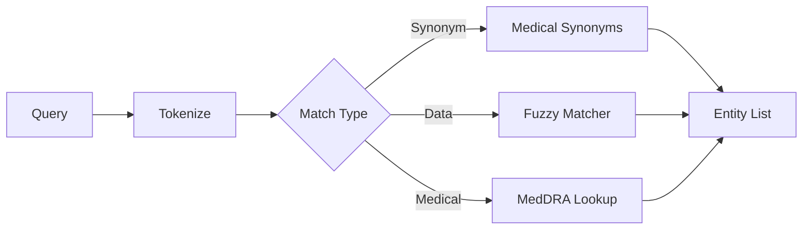

# Entity Extractor

The Entity Extractor identifies clinical terms in user queries and maps them to data values.

---

## Overview

**File:** `core/engine/entity_extractor.py`

**Class:** `EntityExtractor`

**Purpose:** Find and resolve clinical terms (AEs, meds, labs) in natural language

---

## Extraction Sources



---

## Match Types

| Type | Source | Example |
|------|--------|---------|
| **medical_synonym** | Synonym dictionary | belly pain → ABDOMINAL PAIN |
| **fuzzy** | Data values | headche → HEADACHE |
| **meddra** | MedDRA hierarchy | cephalalgia → Headache (PT) |
| **exact** | Data values | HEADACHE → HEADACHE |

---

## Usage

### Basic Extraction

```python
from core.engine.entity_extractor import EntityExtractor

extractor = EntityExtractor()
result = extractor.extract("How many subjects had belly pain?")

for entity in result.entities:
    print(f"{entity.original_term} → {entity.matched_term}")
    print(f"  Type: {entity.match_type}")
    print(f"  Confidence: {entity.confidence}%")
```

### Output

```
belly pain → ABDOMINAL PAIN
  Type: medical_synonym
  Confidence: 100%
```

---

## API Reference

### EntityExtractor Class

```python
class EntityExtractor:
    def __init__(
        self,
        fuzzy_matcher: Optional[FuzzyMatcher] = None,
        meddra_lookup: Optional[MedDRALookup] = None,
        min_confidence: float = 70.0
    ):
        """
        Initialize extractor.

        Args:
            fuzzy_matcher: Pre-loaded fuzzy matcher
            meddra_lookup: Pre-loaded MedDRA
            min_confidence: Minimum match confidence
        """

    def extract(self, query: str) -> EntityExtractionResult:
        """
        Extract entities from query.

        Returns:
            EntityExtractionResult with entities, resolved query
        """
```

### EntityMatch

```python
@dataclass
class EntityMatch:
    original_term: str      # What user typed
    matched_term: str       # Resolved term
    match_type: str         # exact, fuzzy, meddra, medical_synonym
    confidence: float       # 0-100
    table: Optional[str]    # e.g., "ADAE"
    column: Optional[str]   # e.g., "AEDECOD"
    meddra_code: Optional[str]  # PT code if MedDRA match
    metadata: Optional[Dict]    # Additional info (variants, etc.)
```

---

## Extraction Priority

1. **Medical Synonyms** (highest priority)
   - UK/US spellings: anaemia → ANAEMIA, ANEMIA
   - Colloquial terms: belly pain → ABDOMINAL PAIN
   - Complex phrases: low blood cell count → WBC DECREASED

2. **MedDRA Lookup**
   - LLT to PT mapping
   - Synonym terms

3. **Fuzzy Matching**
   - Typo correction
   - Partial matches

---

## Medical Synonym Support

### UK/US Spellings

```python
# Both resolve to same variants
result = extractor.extract("Count cases of anemia")
# entity.matched_term = "ANAEMIA"
# entity.metadata["all_variants"] = ("ANAEMIA", "ANEMIA")
```

### Colloquial Terms

```python
result = extractor.extract("Subjects with fever")
# entity.original_term = "fever"
# entity.matched_term = "PYREXIA"
```

### Complex Phrases

```python
result = extractor.extract("low blood cell count cases")
# entity.matched_term = "WHITE BLOOD CELL COUNT DECREASED"
```

---

## Confidence Scoring

| Match Quality | Confidence |
|---------------|------------|
| Exact match | 100% |
| Medical synonym | 100% |
| High fuzzy (>95%) | 95% |
| Good fuzzy (85-95%) | 85% |
| Fair fuzzy (70-85%) | 75% |
| MedDRA match | 90% |

---

## Multi-Entity Extraction

```python
result = extractor.extract(
    "Count subjects with headache and nausea"
)

# Multiple entities:
# - headache → HEADACHE
# - nausea → NAUSEA
```

---

## Error Handling

### Unresolved Terms

```python
result = extractor.extract("Count xyz123 cases")

if result.unresolved_terms:
    print(f"Could not resolve: {result.unresolved_terms}")
```

### Low Confidence

```python
for entity in result.entities:
    if entity.confidence < 80:
        print(f"Low confidence match: {entity.original_term}")
```

---

## Configuration

```python
extractor = EntityExtractor(
    min_confidence=70.0,  # Minimum match score
    enable_synonyms=True,  # Use medical synonyms
    enable_meddra=True,    # Use MedDRA lookup
)
```

---

## Next Steps

- [Table Resolver](table-resolver.md)
- [Medical Synonyms](medical-synonyms.md)
- [Fuzzy Matching](../factory3-dictionary/fuzzy-matching.md)
