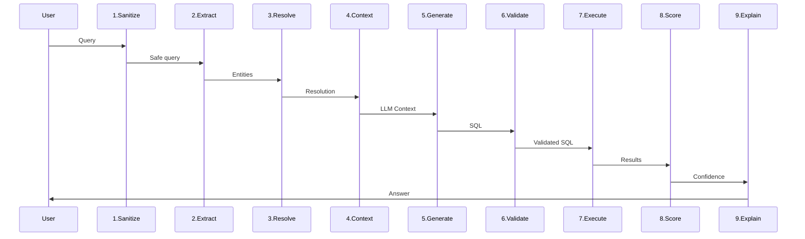
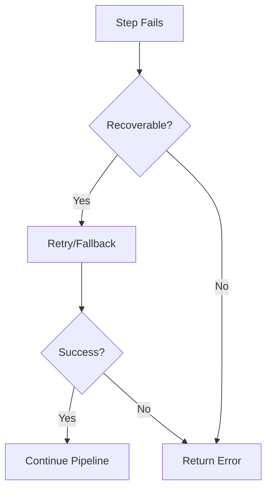

# Pipeline Steps

Detailed breakdown of the 9-step query processing pipeline.

---

## Pipeline Flow



---

## Step 1: Input Sanitization

**Component:** `InputSanitizer`

### Purpose

Protect the system from malicious input:

- Block PHI/PII (patient data)
- Prevent SQL injection
- Stop prompt injection

### Example

```
Input: "Show data for patient John Smith SSN 123-45-6789"

Output: BLOCKED
Reason: "Query contains protected health information"
```

### Processing Time

~5ms

---

## Step 2: Entity Extraction

**Component:** `EntityExtractor`

### Purpose

Identify clinical terms in the query:

- Adverse event terms
- Medication names
- Lab tests
- Populations

### Processing

1. Tokenize query
2. Check medical synonyms dictionary
3. Fuzzy match against data values
4. Lookup MedDRA terms
5. Return entity list with confidence

### Example

```
Input: "How many subjects had belly pain?"

Entities:
- "belly pain" → ABDOMINAL PAIN (medical_synonym, 100%)
```

### Processing Time

~50ms

---

## Step 3: Table Resolution

**Component:** `TableResolver`

### Purpose

Determine which table and population to query:

- Select appropriate table (ADaM vs SDTM)
- Apply population filter
- Map columns to concepts

### Clinical Rules

| Query Type | Table | Population |
|------------|-------|------------|
| Adverse events | ADAE | Safety (SAFFL) |
| Demographics | ADSL | ITT (ITTFL) |
| Laboratory | ADLB | Safety (SAFFL) |

### Example

```
Query: "Count serious adverse events"

Resolution:
- Table: ADAE (ADaM preferred)
- Population: Safety (SAFFL='Y')
- Filter: AESER='Y'
- Grade column: ATOXGR
```

### Processing Time

~10ms

---

## Step 4: Context Building

**Component:** `ContextBuilder`

### Purpose

Prepare the LLM context for SQL generation:

- System prompt with rules
- Schema information
- Entity mappings
- Clinical rules

### Context Structure

```
System Prompt:
- Role definition
- SQL output format
- Column usage rules

Schema Context:
- Table: ADAE
- Columns: USUBJID, AEDECOD, AESER, ATOXGR, ...

Entity Context:
- headache → AEDECOD='HEADACHE'

Clinical Rules:
- Use SAFFL='Y' for safety population
- Use ATOXGR for grade (not AETOXGR)

User Prompt:
Q: How many subjects had headache?
```

### Token Budget

Target: <1500 tokens

### Processing Time

~5ms

---

## Step 5: SQL Generation

**Component:** `SQLGenerator`

### Purpose

Generate DuckDB SQL from natural language:

- Call Claude API
- Parse SQL from response
- Extract reasoning

### API Call

```python
response = anthropic.messages.create(
    model="claude-sonnet-4-20250514",
    temperature=0,  # Deterministic
    messages=[
        {"role": "system", "content": system_prompt},
        {"role": "user", "content": user_prompt}
    ]
)
```

### Example Output

```sql
SELECT COUNT(DISTINCT USUBJID) AS subject_count
FROM ADAE
WHERE SAFFL = 'Y'
  AND UPPER(AEDECOD) = 'HEADACHE'
```

### Processing Time

~1000-2000ms (API call)

---

## Step 6: SQL Validation

**Component:** `SQLValidator`

### Purpose

Ensure SQL is safe to execute:

- Parse SQL syntax
- Verify tables exist
- Verify columns exist
- Block dangerous operations

### Checks

| Check | Description |
|-------|-------------|
| Syntax | Valid DuckDB SQL |
| Tables | All tables in schema |
| Columns | All columns exist |
| Read-only | No INSERT/UPDATE/DELETE |
| Safe patterns | No dangerous SQL |

### Example

```
SQL: SELECT * FROM ADAE; DROP TABLE ADAE;

Result: BLOCKED
Reason: "Dangerous pattern detected: DROP TABLE"
```

### Processing Time

~10ms

---

## Step 7: Execution

**Component:** `Executor`

### Purpose

Run SQL against DuckDB:

- Open read-only connection
- Execute with timeout
- Convert results to dict

### Configuration

```python
executor = Executor(
    db_path=db_path,
    timeout_seconds=30,
    max_rows=10000,
    read_only=True
)
```

### Example

```
SQL: SELECT COUNT(DISTINCT USUBJID) FROM ADAE WHERE SAFFL='Y'

Result:
- success: True
- data: [{"count_distinct": 45}]
- row_count: 1
- execution_time_ms: 50
```

### Processing Time

~10-500ms (query dependent)

---

## Step 8: Confidence Scoring

**Component:** `ConfidenceScorer`

### Purpose

Calculate answer reliability:

### Components

| Component | Weight | Measures |
|-----------|--------|----------|
| Entity Resolution | 40% | How well terms matched |
| Metadata Coverage | 30% | Columns in metadata |
| Execution Success | 20% | Query ran without error |
| Result Sanity | 10% | Results make sense |

### Thresholds

| Score | Level | Color |
|-------|-------|-------|
| 90-100% | HIGH | GREEN |
| 70-89% | MEDIUM | YELLOW |
| 50-69% | LOW | ORANGE |
| <50% | VERY_LOW | RED |

### Example

```
Entity Resolution: 95% (headache matched exactly)
Metadata Coverage: 100% (all columns documented)
Execution Success: 100% (no errors)
Result Sanity: 90% (count is reasonable)

Overall: 96% → HIGH (GREEN)
```

### Processing Time

~5ms

---

## Step 9: Explanation Generation

**Component:** `ExplanationGenerator`

### Purpose

Create human-readable response:

- Format answer
- Add methodology
- Include confidence
- Optionally show SQL

### Example Output

```
45 subjects experienced headache in the safety population.

Methodology:
- Table: ADAE
- Population: Safety (SAFFL='Y')
- Filter: AEDECOD = 'HEADACHE'

Confidence: 96% (HIGH)
```

### Processing Time

~5ms

---

## Total Processing Time

| Step | Typical Time |
|------|-------------|
| 1. Sanitize | 5ms |
| 2. Extract | 50ms |
| 3. Resolve | 10ms |
| 4. Context | 5ms |
| 5. Generate | 1500ms |
| 6. Validate | 10ms |
| 7. Execute | 100ms |
| 8. Score | 5ms |
| 9. Explain | 5ms |
| **Total** | **~1.7s** |

---

## Error Recovery

Each step can trigger recovery:



---

## Next Steps

- [Input Sanitizer](input-sanitizer.md)
- [Entity Extractor](entity-extractor.md)
- [Confidence Scorer](confidence-scorer.md)
