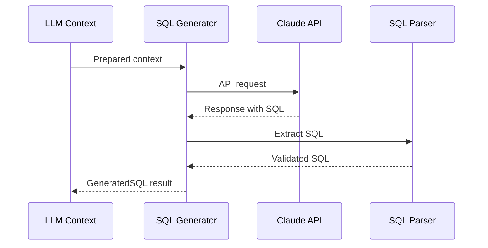

# SQL Generator

The SQL Generator uses Claude API to translate natural language into DuckDB SQL.

---

## Overview

**File:** `core/engine/sql_generator.py`

**Class:** `SQLGenerator`

**Purpose:** Generate safe, accurate SQL from prepared context

---

## How It Works



---

## Usage

### Basic Generation

```python
from core.engine.sql_generator import SQLGenerator

generator = SQLGenerator()
result = generator.generate(context)

print(result.sql)
print(result.reasoning)
```

### Output

```sql
SELECT COUNT(DISTINCT USUBJID) AS subject_count
FROM ADAE
WHERE SAFFL = 'Y'
  AND UPPER(AEDECOD) = 'HEADACHE'
```

---

## API Configuration

### Environment Variables

```env
ANTHROPIC_API_KEY=sk-ant-...
CLAUDE_MODEL=claude-sonnet-4-20250514
CLAUDE_TEMPERATURE=0
CLAUDE_MAX_TOKENS=4096
```

### Initialization

```python
generator = SQLGenerator(
    api_key=os.environ.get("ANTHROPIC_API_KEY"),
    model="claude-sonnet-4-20250514",
    temperature=0,  # Deterministic output
    max_tokens=4096
)
```

---

## API Reference

### SQLGenerator Class

```python
class SQLGenerator:
    def __init__(
        self,
        api_key: Optional[str] = None,
        model: str = "claude-sonnet-4-20250514",
        temperature: float = 0,
        max_tokens: int = 4096
    ):
        """Initialize SQL generator."""

    def generate(
        self,
        context: LLMContext,
        retry_on_error: bool = True
    ) -> GeneratedSQL:
        """
        Generate SQL from context.

        Args:
            context: Prepared LLM context
            retry_on_error: Retry with modified prompt on parse error

        Returns:
            GeneratedSQL with sql, reasoning, metadata
        """

    def generate_with_feedback(
        self,
        context: LLMContext,
        error_message: str
    ) -> GeneratedSQL:
        """Regenerate SQL with error feedback."""
```

### GeneratedSQL

```python
@dataclass
class GeneratedSQL:
    sql: str                    # The generated SQL query
    reasoning: str              # LLM's explanation
    tables_used: List[str]      # Tables in query
    columns_used: List[str]     # Columns in query
    filters_applied: List[str]  # WHERE conditions
    generation_time_ms: float   # API call time
    model_used: str             # Model identifier
    raw_response: Optional[str] # Full API response
```

---

## Prompt Engineering

### System Prompt Structure

```
You are a DuckDB SQL generator for clinical trial data.

RULES:
1. Output ONLY valid DuckDB SQL
2. Use provided table and columns
3. Apply population filters
4. Use UPPER() for case-insensitive matching
5. Count DISTINCT USUBJID for subject counts

TABLE: {table_name}
COLUMNS: {column_list}
POPULATION: {filter}

ENTITY MAPPINGS:
{entity_mappings}
```

### User Prompt

```
Q: How many subjects had headache?
USE: AEDECOD='HEADACHE'
```

---

## SQL Extraction

### Response Parsing

```python
def _extract_sql(self, response: str) -> str:
    """Extract SQL from LLM response."""
    # Look for SQL code blocks
    if "```sql" in response:
        match = re.search(r'```sql\n(.*?)\n```', response, re.DOTALL)
        if match:
            return match.group(1).strip()

    # Look for SELECT statement
    if "SELECT" in response.upper():
        lines = response.split('\n')
        sql_lines = []
        in_sql = False
        for line in lines:
            if "SELECT" in line.upper():
                in_sql = True
            if in_sql:
                sql_lines.append(line)
                if line.strip().endswith(';'):
                    break
        return '\n'.join(sql_lines)

    raise SQLParseError("Could not extract SQL from response")
```

---

## Error Recovery

### Retry on Parse Error

```python
result = generator.generate(context, retry_on_error=True)

# If first attempt fails to parse, retries with:
# "Your previous response could not be parsed as SQL.
#  Please output ONLY the SQL query, nothing else."
```

### Regenerate with Feedback

```python
# If SQL fails validation
result = generator.generate_with_feedback(
    context,
    error_message="Column AETOXGR not found, use ATOXGR instead"
)
```

---

## Performance

### Typical Response Times

| Model | Tokens | Time |
|-------|--------|------|
| claude-sonnet-4-20250514 | ~200 | 1-2s |
| claude-opus-4-20250514 | ~200 | 2-4s |

### Caching

```python
# Cache identical contexts
generator = SQLGenerator(enable_cache=True)

# Second call with same context is instant
result1 = generator.generate(context)  # 1.5s
result2 = generator.generate(context)  # 0.001s (cached)
```

---

## Mock Mode

For testing without API calls:

```python
generator = SQLGenerator(mock_mode=True)
result = generator.generate(context)

# Returns template SQL based on context
# SELECT COUNT(*) FROM {table} WHERE {filters}
```

---

## Best Practices

1. **Deterministic Output**: Always use temperature=0
2. **Clear Context**: Provide complete schema information
3. **Entity Mappings**: Include resolved terms in prompt
4. **Error Handling**: Enable retry for robustness
5. **Token Efficiency**: Keep context under 1500 tokens

---

## Next Steps

- [SQL Validator](sql-validator.md)
- [Context Builder](context-builder.md)
- [Pipeline Overview](overview.md)
