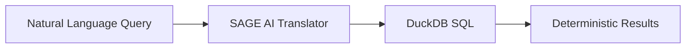

# SAGE - Study Analytics Generative Engine

Welcome to **SAGE**, an on-premise clinical data AI platform that enables natural language queries against SDTM and ADaM clinical trial datasets.

---

## What is SAGE?

SAGE (Study Analytics Generative Engine) is an enterprise-grade platform designed for the pharmaceutical industry. It allows clinical data scientists, biostatisticians, and medical writers to query clinical trial data using plain English.

**Core Principle**: The AI acts as a **TRANSLATOR**, not an **EXPERT**. Mathematical calculations are performed by generated code, not by probabilistic AI inference.



---

## Key Features

| Feature | Description |
|---------|-------------|
| **Natural Language Queries** | Ask questions in plain English, get SQL-backed results |
| **100% On-Premise** | All processing happens locally - no cloud dependency |
| **GAMP 5 Compliant** | Category 4 validation with full audit trail |
| **Confidence Scoring** | Every answer includes reliability indicators |
| **Medical Terminology** | Built-in MedDRA and synonym support |
| **Fuzzy Matching** | Handles typos and spelling variations |

---

## Quick Links

<div class="grid cards" markdown>

-   :material-rocket-launch: **Getting Started**

    ---

    Install SAGE and run your first query

    [:octicons-arrow-right-24: Installation Guide](getting-started/installation.md)

-   :material-account: **User Guide**

    ---

    Learn how to ask questions effectively

    [:octicons-arrow-right-24: User Guide](user-guide/chat-interface.md)

-   :material-cog: **Admin Guide**

    ---

    Configure and manage the platform

    [:octicons-arrow-right-24: Admin Guide](admin-guide/user-management.md)

-   :material-factory: **Architecture**

    ---

    Understand the Four Factories model

    [:octicons-arrow-right-24: Architecture](architecture/overview.md)

-   :material-shield-check: **Compliance**

    ---

    GAMP 5 validation documentation

    [:octicons-arrow-right-24: Compliance](compliance/validation-summary.md)

-   :material-api: **API Reference**

    ---

    REST API documentation

    [:octicons-arrow-right-24: API Reference](api-reference/overview.md)

</div>

---

## Architecture Overview

SAGE uses a **Four Factories Model**:

| Factory | Purpose | Input | Output |
|---------|---------|-------|--------|
| **Factory 1** - Data Foundry | Data ingestion | SAS7BDAT files | DuckDB database |
| **Factory 2** - Metadata Refinery | Spec processing | Excel specifications | Golden Metadata JSON |
| **Factory 3** - Dictionary Plant | Index building | Live data | Fuzzy matching indexes |
| **Factory 4** - Inference Engine | Query processing | Natural language | SQL results |

[Learn more about the architecture :octicons-arrow-right-24:](architecture/overview.md)

---

## Example Query

```
User: How many subjects had serious adverse events in the safety population?

SAGE: Based on the ADAE table with SAFFL='Y' filter, 45 subjects experienced
      at least one serious adverse event (AESER='Y').

      Confidence: 95% (HIGH)

      SQL: SELECT COUNT(DISTINCT USUBJID) FROM ADAE
           WHERE SAFFL='Y' AND AESER='Y'
```

---

## Technology Stack

| Component | Technology |
|-----------|------------|
| AI/LLM | Claude API |
| Database | DuckDB |
| Fuzzy Matching | RapidFuzz |
| Medical Terms | MedDRA integration |
| API | FastAPI |
| UI | React + TypeScript |
| Documentation | MkDocs Material |
| Containerization | Docker Compose |

---

## Support

- **Documentation Issues**: Check the [troubleshooting guide](admin-guide/troubleshooting.md)
- **System Questions**: Use "Ask the System" feature in the chat interface
- **Technical Support**: Contact your system administrator

---

*SAGE - Making clinical data accessible through natural language*
